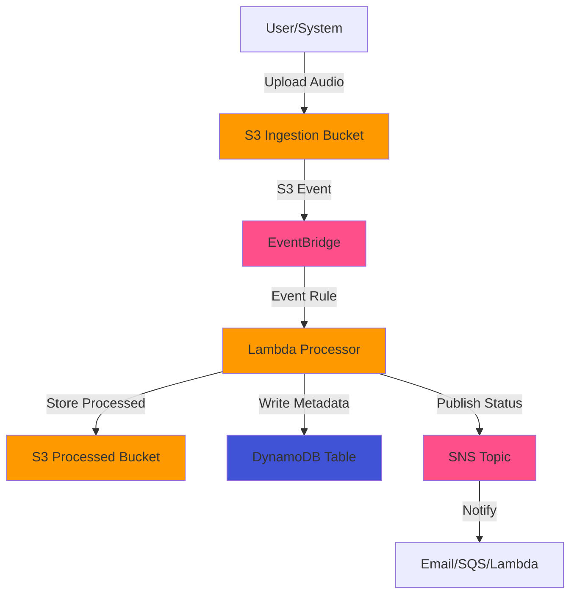

# Sleep Audio Pipeline Architecture

## Overview

This document describes the architecture of the event-driven sleep audio pipeline built with AWS CDK and TypeScript. The system processes audio files uploaded to S3, triggers event-driven workflows, and stores results across multiple AWS services.

## Architecture Philosophy

- **Event-Driven**: All processing is triggered by events (S3 uploads, EventBridge rules)
- **Serverless**: Leverages AWS Lambda, S3, DynamoDB, and managed services
- **Scalable**: Auto-scales based on demand with no infrastructure management
- **Well-Architected**: Follows AWS Well-Architected Framework principles
- **Test-Driven**: All infrastructure is defined and validated through tests first

## System Components

### 1. Ingestion Layer (S3)

**Purpose**: Accept and store raw sleep audio files uploaded by users or systems.

**Implementation**:
- S3 bucket with encryption at rest (AES-256 or KMS)
- Versioning enabled for data protection
- Lifecycle policies for cost optimization
- Event notifications configured to trigger downstream processing

**Events Generated**:
- `s3:ObjectCreated:*` - Triggers when new audio files are uploaded

### 2. Event Router (EventBridge)

**Purpose**: Decouple event sources from processing targets; enable flexible routing and filtering.

**Implementation**:
- Custom EventBridge event bus for sleep audio events
- Event rules to filter and route based on:
  - File type (e.g., `.mp3`, `.wav`, `.m4a`)
  - Metadata attributes (e.g., duration, quality)
  - Processing requirements
- Event archive for replay and debugging

**Event Schema** (example):
```json
{
  "source": "sleep-audio.ingestion",
  "detail-type": "AudioFileUploaded",
  "detail": {
    "bucket": "string",
    "key": "string",
    "size": "number",
    "contentType": "string",
    "timestamp": "string"
  }
}
```

### 3. Processing Layer (Lambda)

**Purpose**: Process audio files - validate, transform, analyze, or generate metadata.

**Implementation**:
- One or more Lambda functions triggered by EventBridge rules
- Potential processing tasks:
  - Audio validation (format, duration, quality checks)
  - Metadata extraction (duration, bitrate, channels)
  - Transcoding/normalization
  - AI/ML analysis (content classification, quality scoring)
- Outputs trigger additional events or write to storage

### 4. Storage Layer

#### S3 (Processed Audio)
- Bucket for processed/transformed audio files
- Organized with prefix-based structure (e.g., `processed/{year}/{month}/{day}/`)
- Optimized storage classes for infrequent access

#### DynamoDB (Metadata & State)
- Table for audio file metadata and processing state
- Schema:
  - Partition Key: `audioId` (UUID or file hash)
  - Sort Key: `timestamp`
  - Attributes: `fileName`, `duration`, `processingStatus`, `s3Location`, `metadata`
- Global Secondary Indexes for common query patterns
- Point-in-time recovery enabled

### 5. Notification Layer (SNS)

**Purpose**: Notify external systems or users of processing completion, errors, or status changes.

**Implementation**:
- SNS topic for processing notifications
- Subscriptions:
  - Email for critical errors
  - SQS for downstream system integration
  - Lambda for additional automation
- Message filtering for targeted notifications

## Data Flow

1. **Upload**: User/system uploads audio file to ingestion S3 bucket
2. **Event Capture**: S3 triggers EventBridge event via event notification
3. **Routing**: EventBridge rule matches event and triggers processing Lambda
4. **Processing**: Lambda validates, processes, and extracts metadata from audio
5. **Storage**: Processed audio written to output S3 bucket; metadata written to DynamoDB
6. **Notification**: SNS notification sent on success/failure

## Architecture Diagram



## Security Considerations

- All S3 buckets use encryption at rest
- Lambda functions run with least-privilege IAM roles
- VPC endpoints for private communication (when needed)
- CloudWatch Logs for audit trails
- AWS KMS for sensitive data encryption

## Monitoring & Observability

- CloudWatch Metrics for Lambda invocations, errors, duration
- CloudWatch Alarms for critical failures
- X-Ray tracing for distributed request tracking
- EventBridge metrics for event delivery
- DynamoDB metrics for throttling and capacity

## Future Enhancements

- Step Functions for complex multi-step workflows
- AppSync GraphQL API for real-time queries
- Cognito for user authentication
- CloudFront for global content delivery
- Athena for analytics on processed data

---

**Note**: This architecture document must stay in sync with the actual CDK implementation. Update this file whenever infrastructure changes are made.
